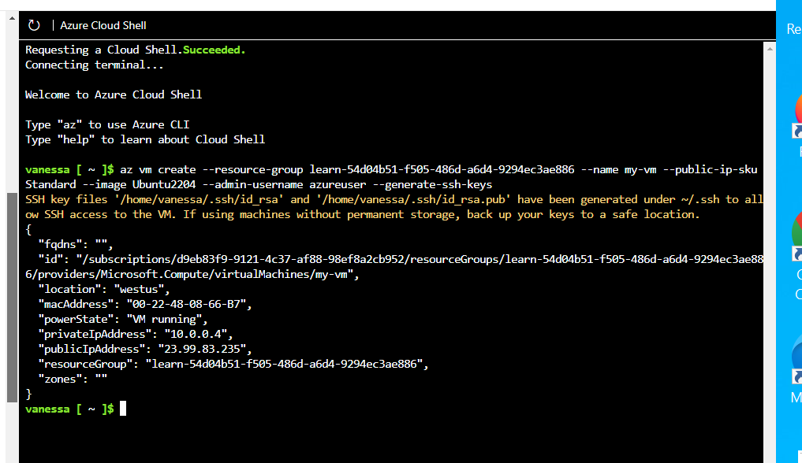
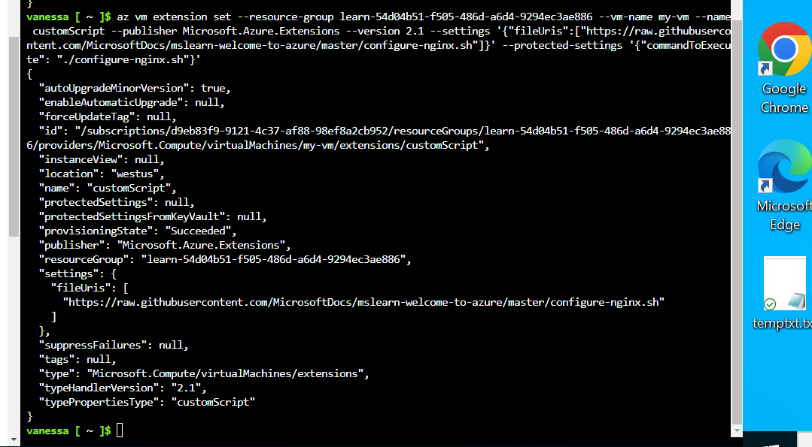

# Exercise - Create an Azure virtual machine

https://learn.microsoft.com/en-us/training/modules/describe-azure-compute-networking-services/3-exercise-create-azure-virtual-machine?source=learn

Sin in to activate sandbox:

In this exercise, you create an Azure virtual machine (VM) and install Nginx, a popular web server.

You could use the Azure portal, the Azure CLI, Azure PowerShell, or an Azure Resource Manager (ARM) template.

In this instance, you're going to use the Azure CLI.

## Task 1: Create a Linux virtual machine and install Nginx

Use the following Azure CLI commands to create a Linux VM and install Nginx. After your VM is created, you'll use the Custom Script Extension to install Nginx. The Custom Script Extension is an easy way to download and run scripts on your Azure VMs. It's just one of the many ways you can configure the system after your VM is up and running.

1. From Cloud Shell, run the following az vm create command to create a Linux VM:

Azure CLI:

```az vm create
az vm create --resource-group [sandbox resource group name] --name my-vm --public-ip-sku Standard --image Ubuntu2204 --admin-username azureuser --generate-ssh-keys
```

Your VM will take a few moments to come up. You named the VM my-vm. You use this name to refer to the VM in later steps.

I have used the command successfully - see screenshot in this section directory 

2. Run the following az vm extension set command to configure Nginx on your VM:

Azure CLI:

```az vm create
az vm extension set --resource-group [sandbox resource group name] --vm-name my-vm --name customScript --publisher Microsoft.Azure.Extensions --version 2.1 --settings '{"fileUris":["https://raw.githubusercontent.com/MicrosoftDocs/mslearn-welcome-to-azure/master/configure-nginx.sh"]}' --protected-settings '{"commandToExecute": "./configure-nginx.sh"}'
```

I have used the command successfully - see screenshot in this section directory 

This command uses the Custom Script Extension to run a Bash script on your VM. The script is stored on GitHub. While the command runs, you can choose to examine the Bash script from a separate browser tab. To summarize, the script:

a. Runs `apt-get update`` to download the latest package information from the internet. This step helps ensure that the next command can locate the latest version of the Nginx package.

b. Installs Nginx.
c. Sets the home page, /var/www/html/index.html, to print a welcome message that includes your VM's host name.

## Continue

That's all for this exercise. The sandbox will keep running, and you'll come back to this point in a few units to update the network configuration so you can get to the website.

### Next unit:

[Describe Azure virtual desktop](https://learn.microsoft.com/en-us/training/modules/describe-azure-compute-networking-services/4-virtual-desktop)
