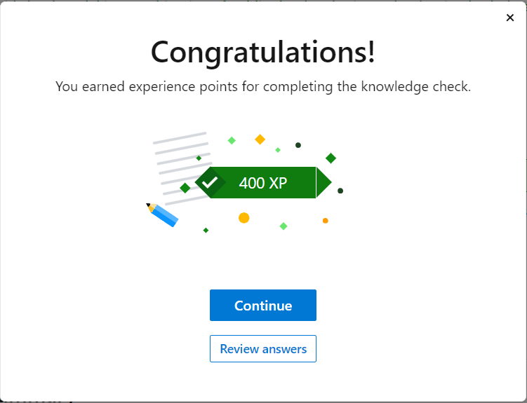

# Knowledge check

Choose the best response for each question. Then select Check your answers.

## Check your knowledge

1. What is cloud computing?
Answer: Delivery of comuting services over the internet.

2. Which cloud model uses some datacenters focused on providing cloud services to anyone that wants them, and some data centers that are focused on a single customer?
Answer: Hybrid cloud.

3. According to the shared responsibility model, which cloud service type places the most responsibility on the customer?
Answer: infrastructure as a service (IaaS)

